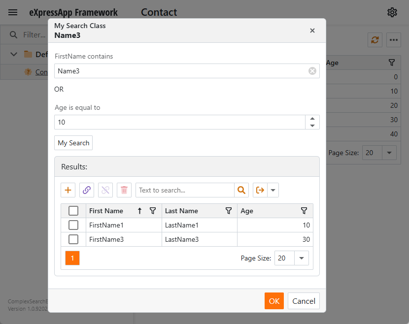

<!-- default badges list -->

[](https://supportcenter.devexpress.com/ticket/details/E1744)
[](https://docs.devexpress.com/GeneralInformation/403183)
[](#does-this-example-address-your-development-requirementsobjectives)
<!-- default badges end -->


# How to search for XAF objects using a complex criterion

This example creates a pop-up window that allows users to perform a custom object search.



## Implementation Details

1. Create a [non-persistent](https://docs.devexpress.com/eXpressAppFramework/116516/business-model-design-orm/non-persistent-objects) class with properties used to search persistent objects.  
    _File to review: [MySearchClass.cs](CS/EFCore/ComplexSearchEF/ComplexSearchEF.Module/BusinessObjects/MySearchClass.cs)_
    ```cs
    [DomainComponent]
    public class MySearchClass : NonPersistentBaseObject {
        [XafDisplayName("FirstName contains:")]
        public string FirstName { get; set; }
        [XafDisplayName("Age is equal to:")]
        public int Age { get; set; }
        // ...
    }
    ```

2. Add a collection of persistent objects that contains the search results.  
     _File to review: [MySearchClass.cs](CS/EFCore/ComplexSearchEF/ComplexSearchEF.Module/BusinessObjects/MySearchClass.cs)_
    ```cs
    [DomainComponent]
    public class MySearchClass : NonPersistentBaseObject {
        // ...
        private IList<Contact> _contacts = new List<Contact>();
        [XafDisplayName("Results:")]
        public IList<Contact> Contacts {
            get {
                return _contacts;
            }
        }
    }
    ```

3. Add the **MySearch** action that populates the collection.
     _File to review: [MySearchController.cs](CS/EFCore/ComplexSearchEF/ComplexSearchEF.Module/Controllers/MySearchController.cs)_
    ```cs
    public class MySearchController : ObjectViewController<DetailView, MySearchClass> {
        public MySearchController() {
            var myAction1 = new SimpleAction(this, "MySearch", "MySearchCategory");
            myAction1.Execute += MyAction1_Execute;
        }
        // ...
    }
    ```

4. When a user clicks the **MySearch** action, create a criterion based on the properties described in the first step and get persistent objects that fit this criterion.  
     _File to review: [MySearchController.cs](CS/EFCore/ComplexSearchEF/ComplexSearchEF.Module/Controllers/MySearchController.cs)_
    ```cs
    public class MySearchController : ObjectViewController<DetailView, MySearchClass> {
        // ...
        private void MyAction1_Execute(object sender, SimpleActionExecuteEventArgs e) {
            var mySearchObject = (MySearchClass)View.CurrentObject;
            var persistentOS = Application.CreateObjectSpace(typeof(Contact));
            var criterion = CriteriaOperator.FromLambda<Contact>(x => x.FirstName.Contains(mySearchObject.FirstName) || x.Age == mySearchObject.Age);
            var results = persistentOS.GetObjects<Contact>(criterion);
            mySearchObject.SetContacts(results);
        }
    }
    ```

5. Create the **MyShowSearchAction** to display the **MySearchClass** detail view from the **Contact** list view in a pop-up window.
     _File to review: [MyShowSearchController.cs](CS/EFCore/ComplexSearchEF/ComplexSearchEF.Module/Controllers/MyShowSearchController.cs)_
    ```cs
    public class MyShowSearchController : ObjectViewController<ListView, Contact> {
        public MyShowSearchController() {
            var mypopAction1 = new PopupWindowShowAction(this, "MyShowSearchAction", PredefinedCategory.Edit);
            mypopAction1.TargetViewNesting = Nesting.Root;
            mypopAction1.CustomizePopupWindowParams += MyAction1_CustomizePopupWindowParams;
        }
        private void MyAction1_CustomizePopupWindowParams(object sender, CustomizePopupWindowParamsEventArgs e) {
            var nonPersistentOS = (NonPersistentObjectSpace)Application.CreateObjectSpace(typeof(MySearchClass));
            var persistentOS = Application.CreateObjectSpace(typeof(Contact));
            nonPersistentOS.AdditionalObjectSpaces.Add(persistentOS);
            var obj = nonPersistentOS.CreateObject<MySearchClass>();
            nonPersistentOS.CommitChanges();
            var view = Application.CreateDetailView(nonPersistentOS, obj);
            e.View = view;
        }
    }
    ```


## Files to Review
* [MySearchClass.cs](CS/EFCore/ComplexSearchEF/ComplexSearchEF.Module/BusinessObjects/MySearchClass.cs)
* [Model.DesignedDiffs.xafml](CS/EFCore/ComplexSearchEF/ComplexSearchEF.Module/Model.DesignedDiffs.xafml)
* [MySearchController.cs](CS/EFCore/ComplexSearchEF/ComplexSearchEF.Module/Controllers/MySearchController.cs)
* [MyShowSearchController.cs](CS/EFCore/ComplexSearchEF/ComplexSearchEF.Module/Controllers/MyShowSearchController.cs)

## Documentation

- [Non-Persistent classes](https://docs.devexpress.com/eXpressAppFramework/116516/business-model-design-orm/non-persistent-objects)
- [How to: Show Persistent Objects in a Non-Persistent Object's View](https://docs.devexpress.com/eXpressAppFramework/116106/business-model-design-orm/non-persistent-objects/how-to-show-persistent-objects-in-a-non-persistent-objects-view#persistent-collection)
- [How to: Include an Action to a Detail View Layout](https://docs.devexpress.com/eXpressAppFramework/112816/task-based-help/miscellaneous-ui-customizations/how-to-include-an-action-to-a-detail-view-layout)
- [Create, Read, Update and Delete Data](https://docs.devexpress.com/eXpressAppFramework/113711/data-manipulation-and-business-logic/create-read-update-and-delete-data)
- [Ways to Show a View](https://docs.devexpress.com/eXpressAppFramework/112803/ui-construction/views/ways-to-show-a-view/ways-to-show-a-view)

<!-- feedback -->
## Does this example address your development requirements/objectives?

[](https://www.devexpress.com/support/examples/survey.xml?utm_source=github&utm_campaign=XAF-search-objects-using-complex-criterion&~~~was_helpful=yes) [](https://www.devexpress.com/support/examples/survey.xml?utm_source=github&utm_campaign=XAF-search-objects-using-complex-criterion&~~~was_helpful=no)

(you will be redirected to DevExpress.com to submit your response)
<!-- feedback end -->
